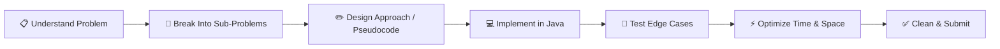
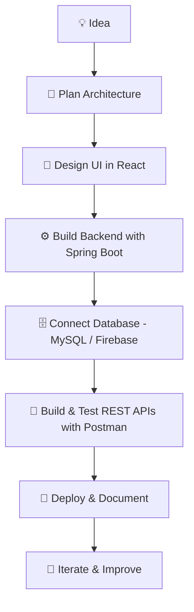

<div align="center">


<br/>

<a href="https://github.com/rakheebshaikh906-droid">
  
</a>

<br/><br/>


</div>

<br/>

## 🚀 Hero

<div align="center">

### 👋 Hi, I'm **Rakheeb Shaikh** — a passionate **Backend & Full Stack Developer** crafting scalable, efficient, and elegant software solutions.

**B.Tech in Electronics and Computer Engineering** • Aspiring **Software Engineer** at a top-tier tech company

🎯 Currently sharpening skills in **Java, Spring Boot, React, SQL & System Design**
🧩 **475+ LeetCode problems solved** with strong Data Structures & Algorithms fundamentals
🤖 Building real-world **AI-powered applications** that solve genuine problems

</div>

<br/>

---

## 🧑‍💻 About Me

```java
public class RakheebShaikh {

    private String role = "Backend / Full Stack Developer";
    private String education = "B.Tech - Electronics & Computer Engineering";
    private String[] currentFocus = {
        "Java", "Data Structures & Algorithms", "Spring Boot",
        "React", "SQL", "System Design", "AI Projects"
    };
    private int leetcodeSolved = 475;
    private boolean opentoWork = true;

    public String[] currentlyLearning() {
        return new String[] {
            "Advanced Spring Boot", "Microservices",
            "System Design", "Cloud Fundamentals"
        };
    }

    public String motto() {
        return "Consistency beats intensity. Ship, learn, repeat.";
    }
}
```

I'm a detail-driven engineer who enjoys turning complex problems into clean, maintainable code. My journey blends strong **DSA fundamentals**, hands-on **full-stack development**, and a growing interest in **AI-integrated applications**. I actively solve algorithmic problems daily, build production-style projects end-to-end, and continuously push myself toward writing better, scalable backend systems.

- 🔭 Currently building projects around **AI integration, Spring Boot backends, and React frontends**
- 🌱 Currently deepening my knowledge of **System Design & Backend Engineering**
- 💡 Strong believer in **clean code, OOP principles, and real-world problem solving**
- 🎯 Goal: Land a **Software Engineering / Backend Development internship** at a top product-based company
- ⚡ Fun fact: I debug faster with a cup of chai in hand ☕

<br/>

---

## 🛠️ Tech Stack

<div align="center">

### 💻 Programming Languages


### 🎨 Frontend Development


### ⚙️ Backend Development


### 🗄️ Databases


### 🧰 Tools & Platforms


### 🤖 AI & Concepts


</div>

<br/>

<div align="center">

| Category | Technologies |
|---|---|
| **Languages** |      |
| **Frontend** |     |
| **Backend** |   |
| **Databases** |   |
| **Tools** |      |
| **Concepts** |      |

</div>

<br/>

---

## 📈 Skill Proficiency

<div align="center">

**Java**
```
████████████████████░░░░  85%
```
**Data Structures & Algorithms**
```
████████████████████░░░░  85%
```
**Spring Boot**
```
███████████████░░░░░░░░░  65%
```
**React**
```
█████████████████░░░░░░░  75%
```
**SQL**
```
█████████████████░░░░░░░  75%
```
**System Design**
```
███████████░░░░░░░░░░░░░  45%
```
**Python**
```
████████████████░░░░░░░░  70%
```
**C++**
```
████████████████░░░░░░░░  70%
```

</div>

<br/>

---

## 🧠 Core CS Fundamentals

<div align="center">

| Concept | Status |
|---|---|
| Object-Oriented Programming (OOP) | ✅ Strong |
| Database Management Systems (DBMS) | ✅ Strong |
| Operating Systems (OS) | ✅ Solid |
| Computer Networks (CN) | ✅ Solid |
| REST APIs | ✅ Strong |
| Data Structures & Algorithms | ✅ Very Strong (475+ Problems) |
| System Design | 🌱 Actively Learning |

</div>

<br/>

---

## 🗂️ How I Approach Problem Solving



<br/>

---

## 🏗️ My Development Workflow



<br/>

---

## 🔗 Connect With Me

<div align="center">

[](https://github.com/rakheebshaikh906-droid)
[](#)
[](#)
[](#)
[](#)

</div>

<br/>

---

## 📊 GitHub Statistics

<div align="center">


<br/>


<br/>


</div>

<br/>

### 🏆 GitHub Trophies

<div align="center">

</div>

<br/>

---

## 🧮 LeetCode Profile

<div align="center">


<br/><br/>


</div>

<br/>

---

## 🌟 Featured Projects

<br/>

### 🤖 Jarvis AI Assistant
<div align="center">


</div>

> A smart, voice-controlled desktop AI assistant built with **Electron** and **React**, integrated with **Gemini AI** for natural conversation.

**✨ Features**
- 🎙️ Voice Assistant with real-time voice command recognition
- 🧠 Gemini AI integration for intelligent conversational responses
- 🖥️ Cross-platform Electron desktop application
- ⚛️ Clean, responsive React-based UI
- 🌤️ Live weather updates
- 💬 Persistent chat history
- 🗣️ Custom voice commands
- 🚀 Local application launcher via voice

**🧱 Architecture Highlights**
- Electron main process handles OS-level integrations (app launching, system tray)
- React renderer process delivers a smooth, component-based UI
- Gemini AI API layer processes natural language queries and returns contextual responses
- Local storage layer persists chat history between sessions

<div align="center">

[](https://github.com/rakheebshaikh906-droid)

</div>

<br/>

### 📸 Smart Attendance System
<div align="center">


</div>

> An AI-powered attendance management system using **facial recognition** to automate and streamline attendance tracking.

**✨ Features**
- 👤 Real-time face recognition for identity verification
- 🔥 Firebase-backed data storage and sync
- 📅 Automated attendance tracking and logging
- 🤖 AI-based accuracy improvements over time

**🧱 Architecture Highlights**
- Face detection & recognition pipeline processes camera feed frames in real time
- Firebase Realtime Database stores attendance logs with timestamps
- AI model matches detected faces against a registered user dataset
- Dashboard view for reviewing attendance history

<div align="center">

[](https://github.com/rakheebshaikh906-droid)

</div>

<br/>

### 📄 Smart Resume Analyzer
<div align="center">


</div>

> An intelligent resume evaluation tool that analyzes resumes and generates **ATS compatibility scores** to help candidates improve their chances.

**✨ Features**
- 📤 Simple resume upload interface
- 🔍 Automated resume content analysis
- 📊 ATS (Applicant Tracking System) score generation
- ⚛️ Built with a fast, responsive React frontend

**🧱 Architecture Highlights**
- File upload component parses resume documents on the client side
- Analysis engine scans content structure, keywords, and formatting
- Scoring algorithm generates an ATS compatibility percentage
- Results rendered through a clean, interactive React dashboard

<div align="center">

[](https://github.com/rakheebshaikh906-droid)

</div>

<br/>

### 🧩 Quiz Application
<div align="center">


</div>

> A full-featured, interactive quiz web application with secure user authentication and real-time data handling.

**✨ Features**
- ⚛️ Dynamic, interactive React-based quiz interface
- 🔥 Firebase for real-time data management
- 🔐 Secure user authentication system

**🧱 Architecture Highlights**
- Firebase Authentication secures user sign-up and login flows
- Firestore/Realtime Database stores questions, scores, and user progress
- React component tree manages quiz state, timers, and scoring logic

<div align="center">

[](https://github.com/rakheebshaikh906-droid)

</div>

<br/>

### 📊 Project Comparison at a Glance

<div align="center">

| Project | Type | Core Tech | Highlight |
|---|---|---|---|
| 🤖 Jarvis AI Assistant | Desktop AI App | Electron, React, Gemini AI | Voice-controlled AI with local app control |
| 📸 Smart Attendance System | AI / Computer Vision | Python, Firebase, Face Recognition | Automated attendance via facial recognition |
| 📄 Smart Resume Analyzer | Web App | React, AI Analysis | Instant ATS score for resumes |
| 🧩 Quiz Application | Web App | React, Firebase Auth | Real-time quiz platform with secure login |

</div>

<br/>

---

## 🏅 Achievements

<div align="center">

| 🏆 Achievement | 📌 Details |
|---|---|
| 🧮 **LeetCode Mastery** | 475+ problems solved with strong DSA fundamentals |
| 💻 **Project Portfolio** | 4+ real-world full-stack & AI-powered projects built end-to-end |
| 🌐 **Open Source** | Actively exploring and contributing to open-source learning |
| 📚 **Daily Learning** | Consistent daily practice in DSA, backend & system design |
| 🎓 **Academic Foundation** | B.Tech in Electronics and Computer Engineering |

</div>

<br/>

---

## 🎯 Current Goals

```text
[■■■■■■■■■□□] Mastering Spring Boot & Backend Engineering
[■■■■■■■□□□] Advanced Data Structures & Algorithms
[■■■■■■□□□□] System Design Fundamentals
[■■■■■□□□□□] Contributing to Open Source Projects
[■■■■■■■■□□] Full Stack Project Development
```

- 🔧 Deepen expertise in **Spring Boot** and backend architecture
- 🧠 Master **advanced DSA** — graphs, DP, trees, and greedy algorithms
- 🏗️ Learn **System Design** — scalability, load balancing, caching, microservices
- 🌍 Start contributing to **Open Source** projects on GitHub
- 🚀 Build and ship more **production-grade full-stack applications**

<br/>

### 🗺️ Learning Roadmap

<div align="center">

| Quarter | Focus Area | Status |
|---|---|---|
| Q1 | Java + DSA Mastery | ✅ Completed |
| Q2 | React + Frontend Engineering | ✅ Completed |
| Q3 | Spring Boot + REST API Development | 🔄 In Progress |
| Q4 | System Design + Microservices | 🔜 Upcoming |
| Next | Open Source Contributions | 🔜 Upcoming |

</div>

<br/>

---

## 🤝 Support & Collaboration

<div align="center">

Interested in collaborating on a project, discussing an internship opportunity, or just want to talk tech?

📩 Reach out via the links above — I'm always happy to connect with fellow developers, mentors, and recruiters.

⭐ If you find my work interesting, consider starring my repositories!

</div>

<br/>

---

## 🎯 Why Work With Me

<div align="center">

| What I Bring | Why It Matters |
|---|---|
| 🧠 475+ LeetCode problems solved | Strong DSA foundation for technical interviews & real-world efficiency |
| ⚙️ Full-stack project experience | Comfortable across React frontends and Java/Spring Boot backends |
| 🤖 AI integration experience | Practical exposure to building AI-powered features, not just theory |
| 📐 CS fundamentals | Solid grasp of OOP, DBMS, OS, and Computer Networks |
| 🔁 Daily consistency | Habit of daily practice — DSA, coding, and continuous learning |
| 🤝 Collaboration-ready | Git/GitHub workflow experience for team-based development |

</div>

<br/>

---

## ❓ Frequently Asked

<details>
<summary><b>What kind of role am I looking for?</b></summary>
<br/>
I'm actively seeking <b>Software Engineering / Backend / Full Stack Developer internships and entry-level roles</b>, particularly at product-based companies where I can contribute to real-world scalable systems.
</details>

<details>
<summary><b>What's my tech stack of choice?</b></summary>
<br/>
Primarily <b>Java + Spring Boot</b> for backend, <b>React + Tailwind CSS</b> for frontend, and <b>MySQL / Firebase</b> for data persistence.
</details>

<details>
<summary><b>How do I approach learning?</b></summary>
<br/>
I balance <b>daily DSA practice</b> with <b>hands-on project building</b> — theory reinforced immediately through implementation.
</details>

<details>
<summary><b>Am I open to collaboration?</b></summary>
<br/>
Absolutely — feel free to reach out for <b>open-source collaboration</b>, <b>hackathons</b>, or <b>project partnerships</b>.
</details>

<br/>

---

## 💬 Quote

<div align="center">

> *"Code is like humor. When you have to explain it, it's bad."*
> — **Cory House**

<br/>

### 🌟 *"Success is the sum of small efforts, repeated day in and day out."* 🌟

</div>

<br/>

---

<div align="center">

### 📈 Contribution Snake


</div>

<br/>

---

<div align="center">

### 💭 Thanks for visiting my profile!

**Let's connect, collaborate, and build something amazing together 🚀**


</div>
